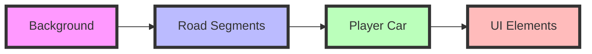

# 🏎️ Pseudo-3D Racing Game Engine
> Building an OutRun-style racing game with JavaScript and HTML5 Canvas. I really learnt a lot on this project and I'm eager to share knowledge of how I went about constructing a realistic game engine for my browser.

<div align="center">

[View Demo](http://codeincomplete.com/projects/racer/v4.final.html) • [Source Code]https://github.com/gidi007/javascript-2D-asphalt-racer.git) • [Report Bug](kieriantirian@gmail.com)

</div>

## 🚥 Table of Contents

<details>
<summary>Click to expand</summary>

- [Overview](#-overview)
- [Core Concepts](#-core-concepts)
- [Implementation](#-implementation)
- [Technical Details](#-technical-details)
- [Getting Started](#-getting-started)
- [Customization](#-customization)
- [Advanced Topics](#-advanced-topics)
- [Resources](#-resources)

</details>

## 🏁 Overview

A step-by-step guide to building a pseudo-3D racing game inspired by classics like OutRun. This implementation focuses on:

- Pure JavaScript and HTML5 Canvas
- No external 3D libraries
- Efficient projection techniques
- Smooth animation and controls

## 🎮 Core Concepts

### 3D Projection Mathematics

The game uses basic trigonometry for 3D projection:

```javascript
// Core projection formula
y = h * d / z

where:
h = camera height
d = distance to screen
z = distance to object
```

### Coordinate Systems

We implement three coordinate spaces:

1. **World Coordinates** (3D game world)
2. **Camera Coordinates** (relative to player view)
3. **Screen Coordinates** (2D canvas rendering)

```javascript
// Projection Pipeline
worldToCamera = {
    x: worldX - cameraX,
    y: worldY - cameraY,
    z: worldZ - cameraZ
};

screenX = (width/2)  + (scale * cameraX * width/2);
screenY = (height/2) - (scale * cameraY * height/2);
```

## 🛠️ Implementation

### Game Constants

```javascript
const GAME_CONFIG = {
    fps: 60,
    width: 1024,
    height: 768,
    roadWidth: 2000,
    segmentLength: 200,
    rumbleLength: 3,
    lanes: 3,
    fieldOfView: 100,
    cameraHeight: 1000,
    drawDistance: 300
};
```

### Road Segment Structure

```javascript
{
    index: n,
    p1: { 
        world: { z: n * segmentLength },
        camera: {},
        screen: {}
    },
    p2: { 
        world: { z: (n+1) * segmentLength },
        camera: {},
        screen: {}
    },
    color: calculateColor(n)
}
```

### 🎨 Rendering Pipeline

<div align="center">



</div>

1. **Background Layers**
   ```javascript
   render() {
       renderSky();
       renderHills();
       renderTrees();
       renderRoad();
       renderCar();
   }
   ```

2. **Road Segments**
   - Project each segment from 3D to 2D
   - Clip segments outside view
   - Draw road, rumble strips, and lane markers

3. **Sprite Rendering**
   - Scale sprites based on distance
   - Apply perspective correction
   - Handle sprite overlap

## 🎯 Key Features

### Player Movement

```javascript
function updatePlayer(dt) {
    position += speed * dt;
    playerX += (keyLeft ? -1 : keyRight ? 1 : 0) * dt;
    speed += (keyUp ? accel : keyDown ? breaking : decel) * dt;
}
```

### Camera Controls

The camera follows the player with:
- Dynamic height adjustment
- Field of view control
- Distance-based fog effects

### 🌈 Visual Effects

- Parallax scrolling backgrounds
- Color-based segment rendering
- Sprite scaling and positioning
- Distance fog
- Speed-based visual effects

## 🚀 Getting Started

1. Clone the repository:
   ```bash
   git clone https://your-repo-url.git
   ```

2. Set up your HTML:
   ```html
   <canvas id="game" width="1024" height="768"></canvas>
   ```

3. Initialize the game:
   ```javascript
   const game = new RacingGame('game');
   game.start();
   ```

## 🎨 Customization

### Road Appearance

```javascript
const COLORS = {
    LIGHT: { road: '#6B6B6B', grass: '#10AA10', rumble: '#555555' },
    DARK:  { road: '#696969', grass: '#009A00', rumble: '#BBBBBB' }
};
```

### Performance Tweaks

```javascript
const PERFORMANCE = {
    drawDistance: 300,   // Number of segments to draw
    fogDensity: 5,      // Fog intensity
    fieldOfView: 100,   // Camera field of view
    cameraHeight: 1000  // Camera height above road
};
```

## 📚 Advanced Topics

- [Implementing Curves](./docs/curves.md)
- [Adding Hills](./docs/hills.md)
- [Collision Detection](./docs/collision.md)
- [Performance Optimization](./docs/performance.md)

## 🎓 Resources

- [Original Pseudo-3D Page](http://www.extentofthejam.com/pseudo/)
- [Game Programming Patterns](http://gameprogrammingpatterns.com/)
- [Canvas Performance Tips](https://developer.mozilla.org/en-US/docs/Web/API/Canvas_API/Tutorial/Optimizing_canvas)

---

<div align="center">

Made with ❤️ by [Gideon Bawa]

**[⬆ Back to top](#-pseudo-3d-racing-game-engine)**

</div>